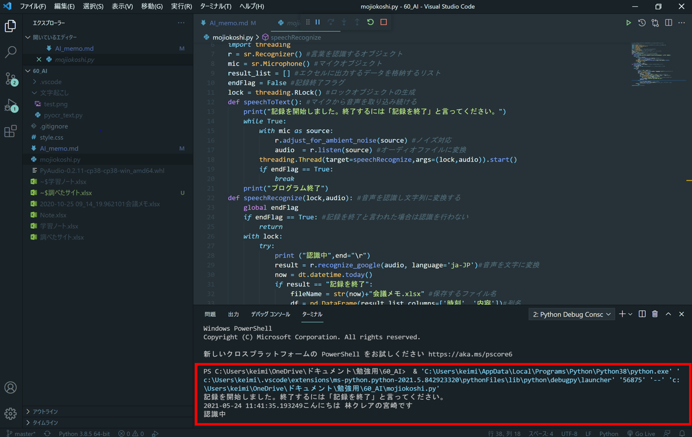

<!-- <link href="./style.css" rel="stylesheet"></link> -->

# AI まとめ

## そもそも AI とはなにか

人工知能（AI : Artificial Intelligence）のこと。

データ量の増大、アルゴリズムの高度化、コンピューティング性能やストレージ技術の発展といった近年の動向により、近年 AI という略語はいっそう広く知られるようになっている。

## AI の歴史

>   引用元: 松尾豊『人工知能は人間を超えるのか　ディープラーニングの先にあるもの』KADOKAWA 発行

| 1950 年代～ 1970 年代    | 1980 年代～ 2010 年代 | 現在                 |
| ------------------------ | --------------------- | -------------------- |
| ニューラル・ネットワーク | 機械学習              | ディープ・ラーニング |

 

## 機械学習（マシンラーニング）と深層学習（ディープラーニング）の違いとは？

数年前から少しずつ認知が広がりつつある「ディープラーニング」も、AI を考える上で抑えておきたいワードの 1 つです。「機械学習（マシンラーニング）」と対比して「深層学習」と呼ばれており、機会学習の手法の 1 つとされています。ディープラーニングとは、人間が手を加えていない未加工のデータ（ビッグデータ）から、コンピュータが自動的にその特徴やパターンを発見する技術のことです。

機械学習で適切なアウトプットを期待するためには、丁寧にデータを加工してあげることが重要だと研究者も考えており、機械学習の実装にはデータの加工もセットになっていました。そのため、データの加工にリソースを割いてしまう関係上、一度に処理できる情報量には限界があったのです。しかし、人がデータを加工せずともコンピュータ自身がその特徴やパターンをデータの中から見つけることができるようになり、アウトプットの精度がこれまでの機械学習を大きく上回るようになるという恩恵がもたらされました。

 

## ライブラリ・フレームワークを使って AI を作る

初心者がまず使い方を覚えるべきライブラリは、以下の 3 つ

- Numpy（ナンパイ。効率的な数値計算が可能）
- Pandas（パンダズ。高速かつ簡単なデータ操作が可能）
- Matplotlib（マットプロットリブ。様々なグラフ描画が可能）

その他よく使われているライブラリ

- scikit-learn（サイキット・ラーン。Python の機械学習ライブラリで無料で利用可能）
- Keras（ケラス。Python で書かれたオープンソースニューラルネットワークライブラリ）
- TensorFlow（テンソルフロー。Google が開発したライブラリ）
- Chainer（チェイナー。日本国内の企業が中心となって開発）
- PyTorch（パイトーチ。Facebook 主導で開発された Python 向けのライブラリ）

# 実現するための手法を選択する

## 教師あり学習

教師あり学習とは、インプットと正解がセットになったデータを投入することで学習させる手法のことです。
これは、たとえば AI に「猫」を覚えさせるときに、猫の画像と、その画像が猫であるという情報を与えることで AI が「猫」を認識できるようにするというものです。

主な種類

- 回帰 （一般化）線形回帰 サポートベクターマシーン（SVM） など
- 木 決定木（CART） 回帰木 ランダムフォレスト 勾配ブースティング木 など
- ニューラルネットワーク（NN） パーセプトロン 畳み込みニューラルネットワーク（CNN） 再起型ニューラルネットワーク（RNN） 残差ネットワーク（ResNet） など
- ベイズ 単純ベイズ（ナイーブベイズ） など
- 時系列 AR,MA,(S)ARIMA モデル 状態空間モデル など
- クラスタリング k 近傍法（KNN） など
- アンサンブル学習 ブースティング バギング など

## 教師なし学習

正解なしのデータを投入し、プログラムが自らデータの特性などを学習します。
たとえば、AI に「猫」を覚えさせるときに、膨大なデータのみを与えることで、AI が自動的に特徴を解析し「猫」という存在を認識するようになるというものです。

主な種類

- クラスタリング 階層型クラスタリング（ユークリッド距離＊ウォード法など） 非階層型クラスタリング（k-means など） トピックモデル（LDA など） など
- ニューラルネットワーク（NN） 自己組織化マップ（SOM）
- その他 アソシエーション分析 協調フィルタリング（アイテムベース、ユーザベースなど） など

# AI に学習させるデータを準備する

機械学習の手法が決まったら、AI に与えるデータも用意する必要があります。
AI は、学習させる前の段階では全く何も知らないまっさらな状態です。この状態から何かを学習させていくためには、質のいい大量のデータが必要になります。

<u>自社で保有しているデータを活用できないか考える</u>
例）小売業であれば何らかの商品の販売データ、製造業であれば品質不良品のデータなど
このとき注意するべき点は、データの質を確保するということです。
人間でも判定に困るようなデータ、対象オブジェクトがあいまいなデータなどを除去し、誤ったラベル付けを行っていないかどうかに注意する必要があります。
このように、データを利用する前にデータの変換・整理・除去などの処理を行うことをデータのクレンジングと言います。

# 作成物

## 音声認識プログラム

音声を自動で文字お越しするプログラム

